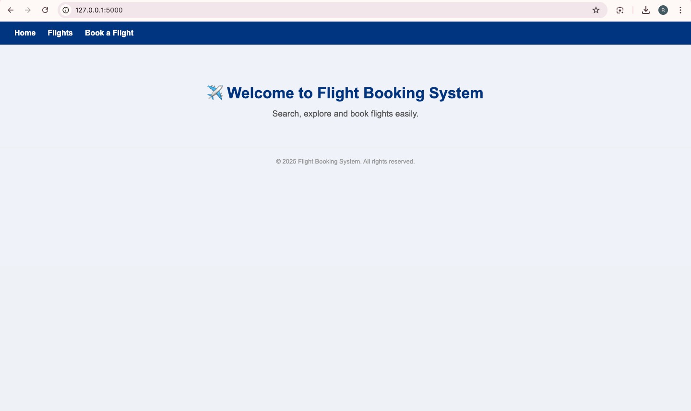
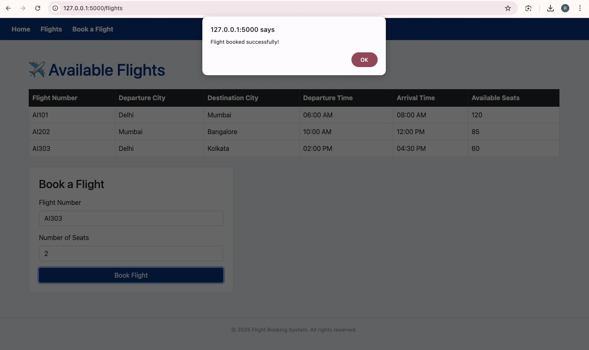
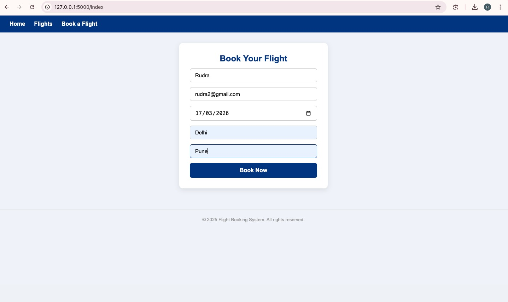
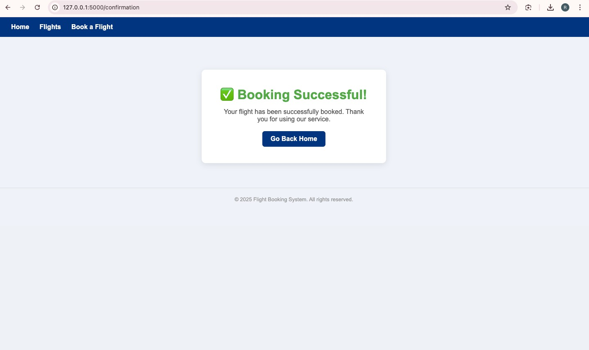
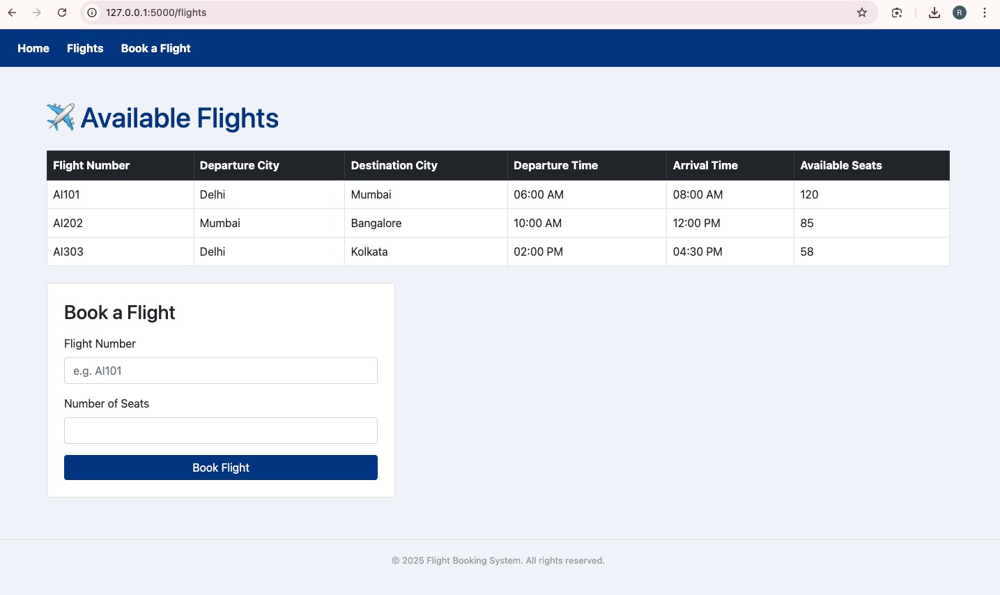

# ✈️ Flight Management System


A **full-stack web application** that allows users to **view available flights, book tickets, and manage seat availability in real-time**.  
The system is built using **Flask (Python backend)** and **MySQL database**, with a responsive interface designed using **HTML, CSS, and Bootstrap 5**.

This project demonstrates **backend development, database integration, REST routing, and dynamic UI updates**.

---

# 🌐 Features

- View available flights
- Book flight tickets with passenger details
- Real-time seat availability updates
- Booking confirmation page
- MySQL database integration
- Secure credentials using `.env`
- Clean and responsive UI

---

# 🖥️ Application Preview

## Home Page


## Available Flights


## Booking Form


## Booking Confirmation


## Live Seat Update


---

# ⚙️ Tech Stack

| Layer | Technology |
|------|-------------|
| Backend | Python, Flask |
| Database | MySQL |
| Frontend | HTML, CSS, Bootstrap 5 |
| Environment | python-dotenv |
| Version Control | Git & GitHub |

---

# 🏗️ System Architecture

```
User (Browser)
       │
       ▼
Frontend (HTML + Bootstrap)
       │
       ▼
Flask Application (Python Backend)
       │
       ▼
MySQL Database
```

---

# 📁 Project Structure

```
flight-management-system
│
├── app.py                  # Main Flask application
├── requirements.txt        # Python dependencies
├── schema.sql              # Database schema + sample data
├── .env                    # Environment variables (not uploaded)
├── .gitignore
├── README.md
│
├── templates
│   ├── home.html
│   ├── flights.html
│   ├── index.html
│   └── confirmation.html
│
├── static
│   └── style.css
│
└── screenshots
    ├── home.png
    ├── flights.png
    ├── booking-form.png
    ├── confirmation.png
    └── seat-update.png
```

---

# 🚀 Installation & Setup

Follow the steps below to run the project locally.

## 1. Clone the Repository

```bash
git clone https://github.com/PrOffesOR/flight-management-system.git
cd flight-management-system
```

---

## 2. Create Virtual Environment

### Mac / Linux
```bash
python3 -m venv venv
source venv/bin/activate
```

### Windows
```bash
python -m venv venv
venv\Scripts\activate
```

---

## 3. Install Dependencies

```bash
pip install -r requirements.txt
```

---

## 4. Create `.env` File

Create a `.env` file in the root directory.

```
DB_HOST=localhost
DB_USER=root
DB_PASSWORD=your_mysql_password
DB_NAME=flight_booking_2232
```

---

## 5. Setup MySQL Database

Login to MySQL:

```bash
mysql -u root -p
```

Run the schema file:

```sql
source /path/to/flight-management-system/schema.sql
```

---

## 6. Run the Application

```bash
python app.py
```

Open the browser and go to:

```
http://127.0.0.1:5000
```

---

# 🗄️ Database Schema

### Flights Table

| Column | Type |
|------|------|
| id | INT (PK, Auto Increment) |
| flight_number | VARCHAR(20) |
| departure_city | VARCHAR(100) |
| destination_city | VARCHAR(100) |
| departure_time | VARCHAR(50) |
| arrival_time | VARCHAR(50) |
| available_seats | INT |

---

### Bookings Table

| Column | Type |
|------|------|
| id | INT (PK, Auto Increment) |
| name | VARCHAR(100) |
| email | VARCHAR(100) |
| date | DATE |
| source | VARCHAR(100) |
| destination | VARCHAR(100) |

---

# 🔗 API Routes

| Route | Method | Description |
|------|--------|-------------|
| `/` | GET | Home Page |
| `/flights` | GET | View available flights |
| `/index` | GET, POST | Booking form |
| `/book-flight` | POST | Submit booking |
| `/confirmation` | GET | Booking confirmation |

---

# 💡 Key Learning Outcomes

- Building **full-stack web applications**
- Flask backend development
- MySQL database design and integration
- RESTful routing and request handling
- Secure configuration using `.env`
- Responsive UI development

---

# 👨‍💻 Author

**Rudra Mukherjee**

Computer Science & Engineering Student  
Amity University

GitHub: https://github.com/PrOffesOR  
LinkedIn: https://linkedin.com/in/rudra-mukherjee  
Email: rudra10655@gmail.com

---

# 📜 License

This project is open source and available under the **MIT License**.